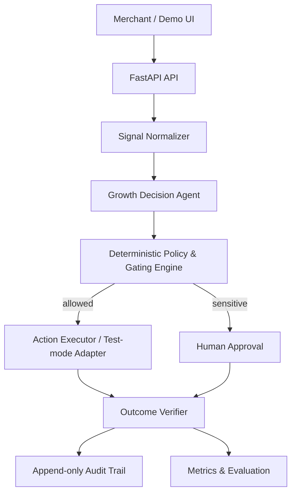

# Architecture

AI-style reasoning is intentionally separated from financial execution. Sensitive incentives are bounded and require approval. Stopping rules prevent repeated contact on stale carts.
